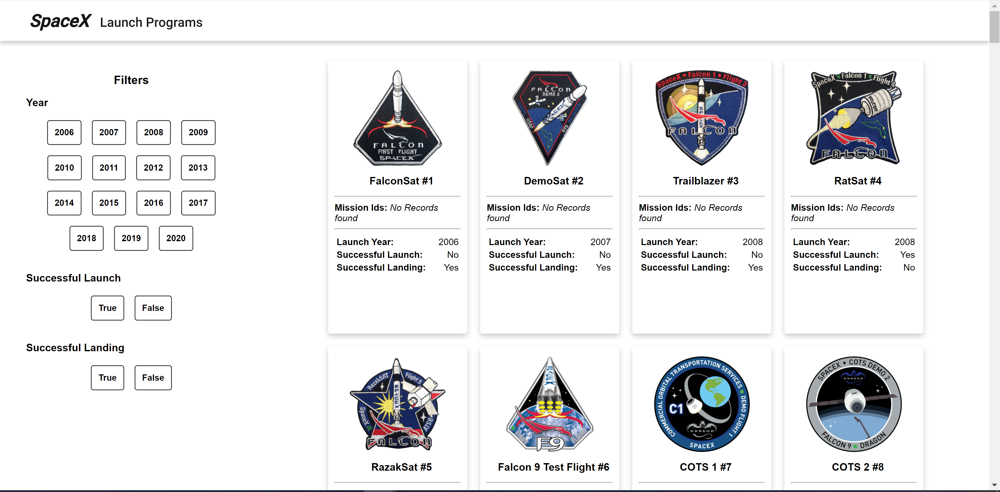
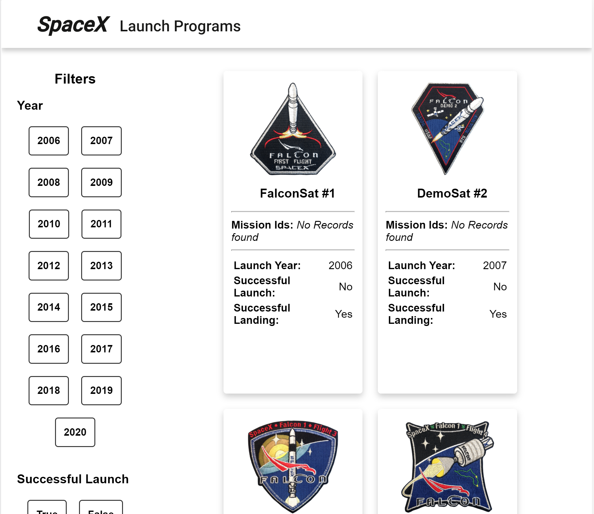
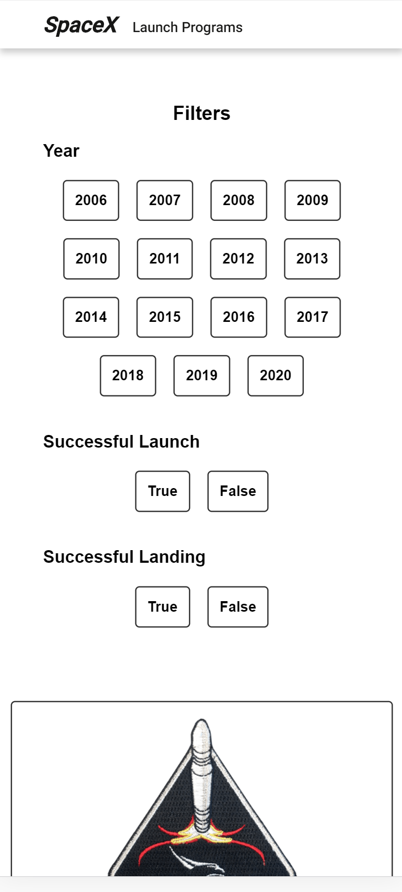
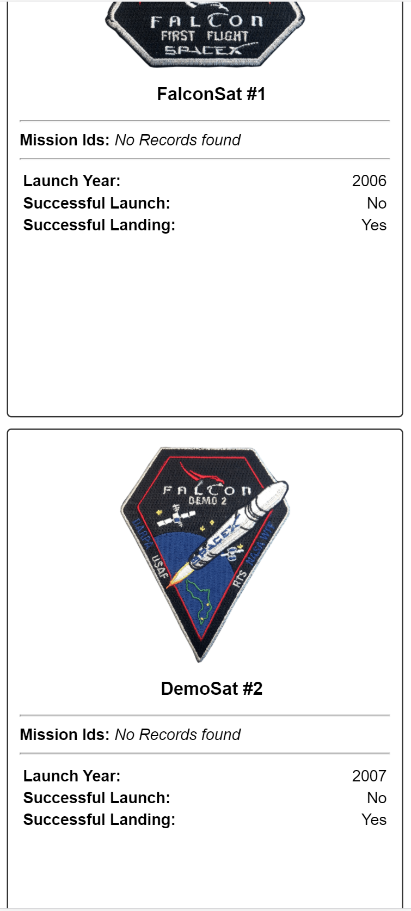
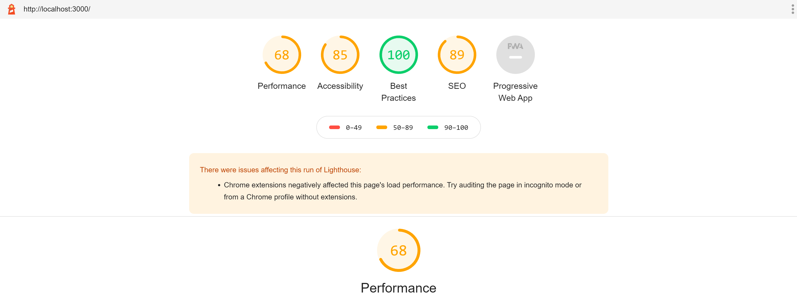

### Prerequisites

[Node](https://nodejs.org/en/) (version 12.18 and above)

### Setup

To set up this application open terminal and run the following command.
```
npm install 
npm run build
npm start

```
The above command will install all the necessary packages and also build the appliation.


## Images





## Performance



## Authors

- Siddhant Painter